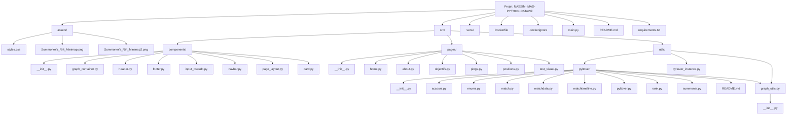

# Python-DataViz

Ce projet est une application de visualisation de données interactives basée sur Dash, Plotly et Python. Elle permet d'analyser les performances des joueurs dans League of Legends en fonction des objectifs pris, des positions et d'autres statistiques clés.

---

## User Guide

### Prérequis
- **Python 3.11.9**
- **Docker** (facultatif, pour une exécution dans un conteneur).

### Installation et Lancement

#### 1. Mise en place de l'environnement virtuel

Créez un environnement virtuel dans le répertoire racine du projet :
```bash
python -m venv .venv
```

Activez l'environnement virtuel :
- PowerShell :
  ```bash
  .venv\Scripts\Activate
  ```
- CMD :
  ```bash
  .venv\Scripts\activate.bat
  ```
- Git Bash :
  ```bash
  source .venv/Scripts/activate
  ```

Installez les dépendances :
```bash
pip install -r requirements.txt
```

Désactivez l'environnement virtuel lorsque vous avez terminé :
```bash
deactivate
```

#### 2. Lancement de l'application

Lancez le serveur Dash localement :
```bash
python main.py
```

Accédez à l'application via votre navigateur web : [http://localhost:8050].

#### 3. Utilisation avec Docker (facultatif)

Pour exécuter l'application via Docker :

1. Construisez l'image Docker :
   ```bash
   docker build -t python-dataviz .
   ```

2. Lancez un conteneur :
   ```bash
   docker run -p 127.0.0.1:8050:8050 python-dataviz
   ```

Accédez à l'application à l'adresse : [http://localhost:8050].

---

## Data

### Description des Données
Les données utilisées dans ce projet proviennent de l'API Riot Games. Elles incluent :
- Les statistiques des matchs : objectifs pris (Baron, Dragon, Herald, etc.), positions des joueurs, victoires/défaites.
- Les actions des joueurs : pings, mouvements, XP, gold.

Les données sont stockées temporairement en mémoire et ne sont pas sauvegardées localement.

### Accès aux Données
- L'application utilise une clé API Riot pour effectuer des requêtes.
- Une librairie a été crée afin de pouvoir communiquer simplement avec l'API Riot
---

## Developer Guide

### Architecture
L'application est divisée en plusieurs modules pour faciliter l'extensibilité :

```
NASSIM-IMAD-PYTHON-DATAVIZ/
├── assets/               # Fichiers CSS et autres ressources statiques
├── src/                  # Code source principal
│   ├── components/       # Composants réutilisables pour Dash
│   ├── pages/            # Pages individuelles du dashboard
│   ├── utils/            # Fonctions utilitaires et accès API
├── main.py               # Point d'entrée de l'application
├── Dockerfile            # Configuration Docker
├── requirements.txt      # Dépendances Python
├── README.md             # Documentation
```

### Ajouter une Page
1. Créez un fichier dans `src/pages/`, par exemple `nouvelle_page.py`.
2. Ajoutez ``` dash.register_page(__name__, '/' + __name__.split('.')[-1]) ``` afin qu'elle soit détecté automatiquement par dash
3. Créer un variable ``` layout ``` qui contiendrait une div avec un id lié au component graph-container avec un id unique
4. Styliser la div

### Ajouter un Graphique
1. Ajout d'une méthode lié à un callback permettant de créer et personnaliser un graph plotly
2. Utiliser la librairie Pylotver (crée pour le projet) afin de récuperer les données depuis l'api RIOT
3. Retourner le graphique plotly

### Diagramme de l'Architecture



---

## Rapport d'Analyse

### Objectifs Clés
1. Identifier les objectifs ayant le plus d'impact sur le winrate des joueurs.
2. Analyser l'influence des positions des joueurs au cours de la partie.
3. Quantifier l'impact des pings et des actions en jeu sur les résultats des parties.

### Conclusions
- **Atakhan et Baron** : Ces objectifs augmentent significativement le taux de victoire.
- **Positions Stratégiques** : Les joueurs se regroupent autour des timings d'objectif représente un avantage.
- **Coordination à travers les Pings** : Une communication efficace est corrélée à un meilleur taux de victoire.

---

## Copyright

Je déclare sur l’honneur que le code fourni a été produit par moi/nous-mêmes, à l’exception des lignes ci-dessous :

- **Utilisation de l'API Riot Games** : Documentation officielle de Riot Games (à des fins d'accès aux données de jeu).
- **Mermaid pour le diagramme d'architecture** : Documentation officielle Mermaid pour générer des diagrammes Markdown.

Toute ligne non déclarée ci-dessus est réputée être produite par l’auteur (ou les auteurs) du projet.

---
